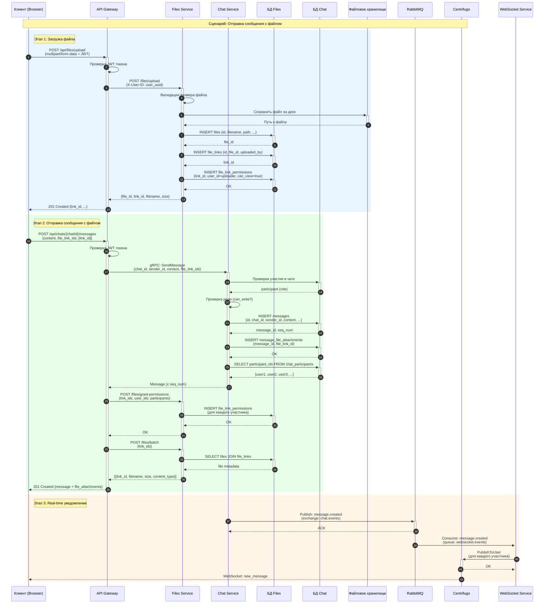
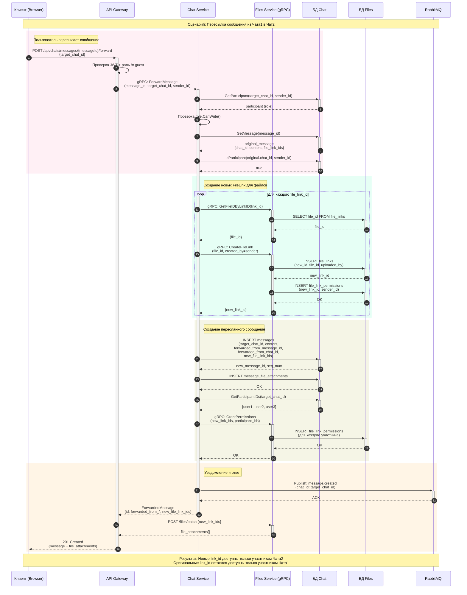
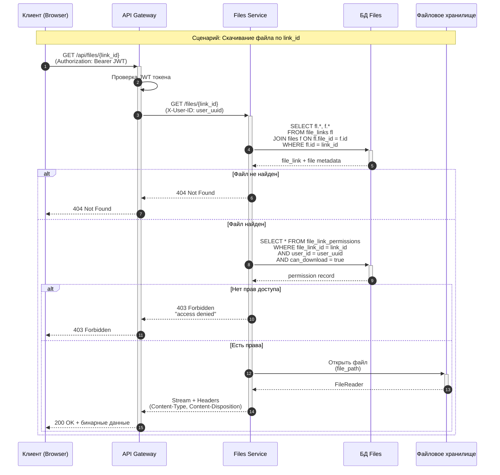
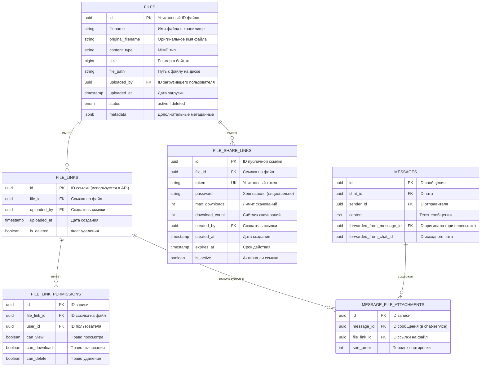
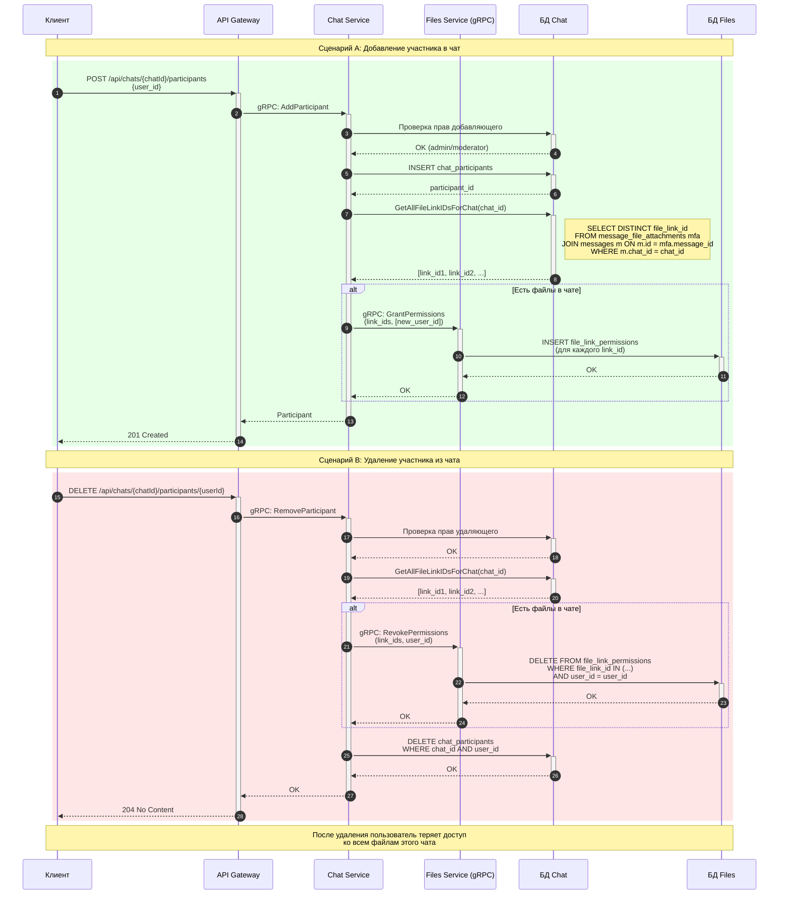
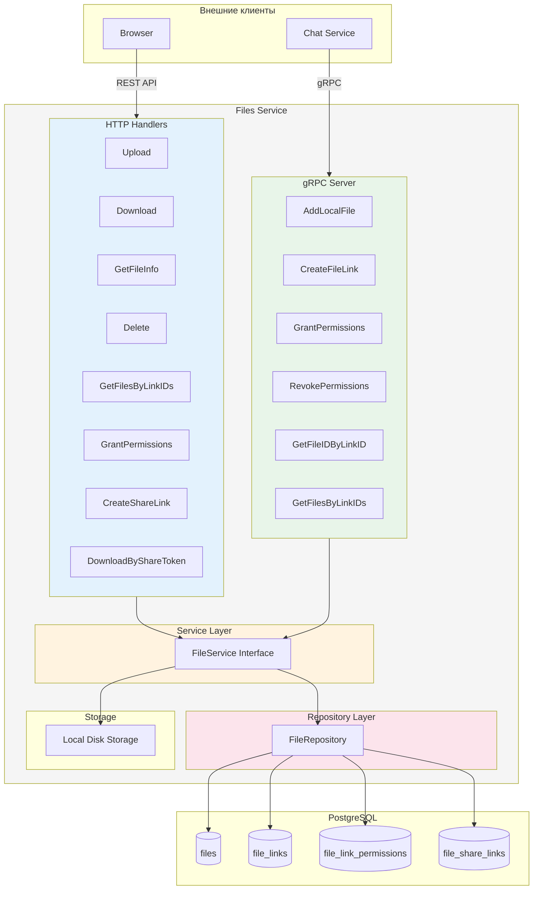

# Диаграммы файловой системы чата

## 1. Диаграмма последовательности: Загрузка файла и отправка сообщения

## 2. Диаграмма последовательности: Пересылка сообщения с файлами

## 3. Диаграмма последовательности: Скачивание файла с проверкой прав

## 4. Диаграмма модели данных Files Service

## 5. Соответствие gRPC и REST API

```mermaid
flowchart TB
    subgraph REST_API["REST API (через API Gateway)"]
        R1["POST /api/files/upload<br/>Загрузка файла"]
        R2["GET /api/files/{linkId}<br/>Скачивание файла"]
        R3["GET /api/files/{linkId}/info<br/>Метаданные файла"]
        R4["DELETE /api/files/{linkId}<br/>Удаление файла"]
        R5["POST /api/files/batch<br/>Пакетное получение метаданных"]
        R6["POST /api/files/grant-permissions<br/>Выдача прав"]
        R7["POST /api/files/{fileId}/share<br/>Создание публичной ссылки"]
        R8["GET /api/files/share/{token}<br/>Скачивание по токену"]
    end

    subgraph GRPC_API["gRPC API (межсервисное)"]
        G1["AddLocalFile<br/>Добавление локального файла"]
        G2["CreateFileLink<br/>Создание новой ссылки"]
        G3["GrantPermissions<br/>Выдача прав пользователям"]
        G4["RevokePermissions<br/>Отзыв прав"]
        G5["GetFileIDByLinkID<br/>Получение file_id по link_id"]
        G6["GetFilesByLinkIDs<br/>Пакетные метаданные"]
    end

    subgraph SERVICE_LAYER["Service Layer"]
        S1["Upload()"]
        S2["Download()"]
        S3["GetFileInfo()"]
        S4["Delete()"]
        S5["GetFilesByLinkIDs()"]
        S6["GrantPermissions()"]
        S7["CreateShareLink()"]
        S8["DownloadByShareToken()"]
        S9["AddLocalFile()"]
        S10["CreateFileLink()"]
        S11["RevokePermissions()"]
        S12["GetFileLinkByID()"]
    end

    %% REST -> Service
    R1 --> S1
    R2 --> S2
    R3 --> S3
    R4 --> S4
    R5 --> S5
    R6 --> S6
    R7 --> S7
    R8 --> S8

    %% gRPC -> Service
    G1 --> S9
    G2 --> S10
    G3 --> S6
    G4 --> S11
    G5 --> S12
    G6 --> S5

    subgraph CONSUMERS["Потребители API"]
        C1["Browser/Клиент<br/>(через API Gateway)"]
        C2["Chat Service<br/>(gRPC клиент)"]
        C3["Другие сервисы<br/>(gRPC клиент)"]
    end

    C1 -.-> REST_API
    C2 -.-> GRPC_API
    C3 -.-> GRPC_API

    style REST_API fill:#e3f2fd
    style GRPC_API fill:#e8f5e9
    style SERVICE_LAYER fill:#fff3e0
    style CONSUMERS fill:#fce4ec
```

## 6. Поток данных при добавлении/удалении участника чата

## 7. Архитектура компонентов Files Service

## Легенда

| Цвет | Значение |
|------|----------|
| 🔵 Синий | REST API / HTTP взаимодействие |
| 🟢 Зелёный | gRPC взаимодействие |
| 🟡 Жёлтый | Service Layer / Бизнес-логика |
| 🔴 Красный | Repository / Данные |
| 🟣 Фиолетовый | Real-time / События |
