# Архитектура файловых прав доступа

## Обзор

Документ описывает систему групповых прав доступа к файлам в чатах.

**Ключевые концепции:**
- Каждый чат имеет две группы: `moderate_all` (полный доступ) и `view_all` (просмотр/скачивание)
- Модераторы видят ВСЕ файлы чата
- Обычные участники видят только файлы, загруженные ПОСЛЕ их вступления в чат
- Права назначаются автоматически через триггеры PostgreSQL

## Модель данных (реальная схема БД)

### Полная ER-диаграмма

```mermaid
erDiagram
    %% ===== USERS DOMAIN =====
    USERS ||--o{ REFRESH_TOKENS : "имеет токены"
    USERS ||--o{ GROUP_MEMBERS : "состоит в группах"
    GROUPS ||--o{ GROUP_MEMBERS : "содержит"

    USERS {
        uuid id PK
        varchar username UK
        varchar email UK
        varchar password_hash
        varchar role "owner/moderator/user/guest"
        timestamp created_at
        timestamp updated_at
    }

    GROUPS {
        uuid id PK
        varchar name
        text description
        timestamp created_at
        timestamp updated_at
    }

    GROUP_MEMBERS {
        uuid id PK
        uuid group_id FK
        uuid user_id FK
        timestamp joined_at
    }

    %% ===== FILES DOMAIN (независимый) =====
    FILES ||--o{ FILE_LINKS : "имеет ссылки"
    FILES ||--o{ FILE_SHARE_LINKS : "публичные ссылки"
    FILE_LINKS ||--o{ FILE_LINK_PERMISSIONS : "индивид. права"
    FILE_LINKS ||--o{ MESSAGE_FILE_ATTACHMENTS : "вложения"

    FILES {
        uuid id PK
        varchar filename
        varchar original_filename
        varchar content_type
        bigint size
        varchar file_path
        uuid uploaded_by
        timestamp uploaded_at
        varchar status "active/deleted"
        jsonb metadata
    }

    FILE_LINKS {
        uuid id PK
        uuid file_id FK
        uuid chat_id FK "NULL = standalone"
        uuid uploaded_by
        timestamp uploaded_at
        boolean is_deleted
    }

    FILE_LINK_PERMISSIONS {
        uuid id PK
        uuid file_link_id FK
        uuid user_id
        boolean can_view
        boolean can_download
        boolean can_delete
    }

    FILE_SHARE_LINKS {
        uuid id PK
        uuid file_id FK
        varchar token UK
        varchar password "nullable"
        int max_downloads "nullable"
        int download_count
        uuid created_by
        timestamp expires_at "nullable"
        boolean is_active
    }

    MESSAGE_FILE_ATTACHMENTS {
        uuid id PK
        uuid message_id
        uuid file_link_id FK
        int sort_order
    }

    %% ===== CHAT DOMAIN =====
    CHATS ||--o{ CHAT_PARTICIPANTS : "участники"
    CHATS ||--o{ MESSAGES : "сообщения"
    MESSAGES ||--o{ MESSAGE_REACTIONS : "реакции"
    MESSAGES ||--o{ MESSAGE_READERS : "прочитано"

    CHATS {
        uuid id PK
        varchar name
        varchar chat_type "private/group/channel"
        uuid created_by
        timestamp created_at
        timestamp updated_at
    }

    CHAT_PARTICIPANTS {
        uuid id PK
        uuid chat_id FK
        uuid user_id
        varchar role "admin/member/readonly"
        timestamp joined_at
    }

    MESSAGES {
        uuid id PK
        uuid chat_id FK
        uuid parent_id FK "nullable"
        uuid sender_id
        text content
        timestamp sent_at
        boolean is_deleted
    }

    %% ===== CHAT-FILES BRIDGE (групповые права) =====
    CHATS ||--o| CHAT_FILE_ACCESS_GROUPS : "группы доступа к файлам"
    CHAT_FILE_ACCESS_GROUPS ||--|| GROUPS : moderate_group
    CHAT_FILE_ACCESS_GROUPS ||--|| GROUPS : view_group
    FILE_LINKS ||--o{ FILE_LINK_GROUP_PERMISSIONS : "групповые права"
    FILE_LINK_GROUP_PERMISSIONS }o--|| GROUPS : "для группы"

    CHAT_FILE_ACCESS_GROUPS {
        uuid id PK
        uuid chat_id FK UK
        uuid moderate_group_id FK
        uuid view_group_id FK
    }

    FILE_LINK_GROUP_PERMISSIONS {
        uuid id PK
        uuid file_link_id FK
        uuid group_id FK
        boolean can_view
        boolean can_download
        boolean can_delete
        timestamp valid_from "nullable"
    }
```

### Три сценария использования файлов

| Сценарий | chat_id | Как работают права |
|----------|---------|-------------------|
| **Standalone файл** | `NULL` | Только `file_link_permissions` (индивидуальные) |
| **Публичная ссылка** | `NULL` | Через `file_share_links` (по токену) |
| **Файл в чате** | `UUID` | `file_link_permissions` + `file_link_group_permissions` |

### Ключевые связи

```
FILES (физический файл)
  └── FILE_LINKS (контекстные ссылки, может быть много на один файл)
        ├── chat_id = NULL → standalone файл
        │     └── FILE_LINK_PERMISSIONS (кому дали доступ вручную)
        │
        └── chat_id = UUID → файл в чате
              ├── FILE_LINK_PERMISSIONS (индивидуальные права)
              └── FILE_LINK_GROUP_PERMISSIONS → GROUPS
                    ├── moderate_all → полный доступ
                    └── view_all → скачивание (с учётом joined_at)
```

## Иерархия прав доступа

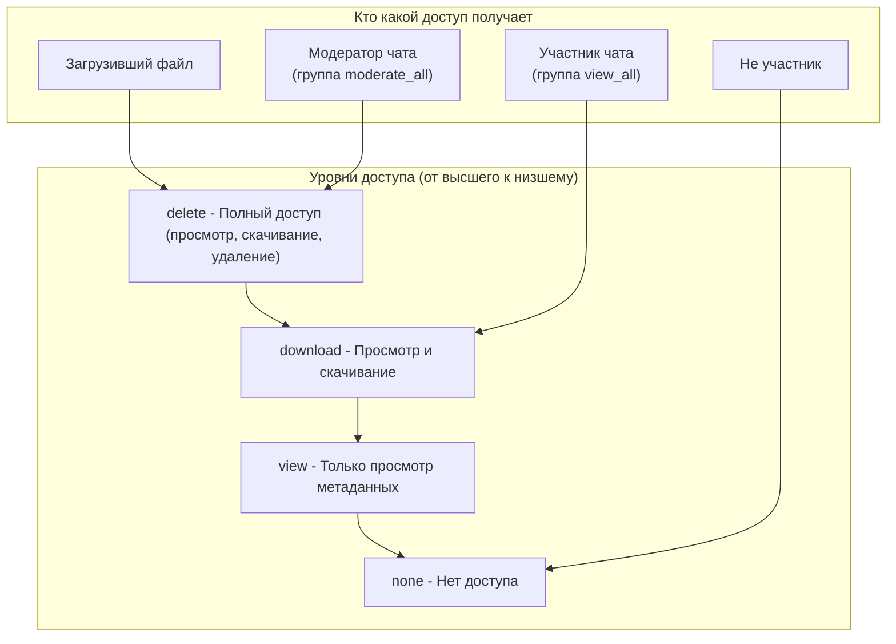

## Создание чата

При создании чата триггер БД автоматически создаёт группы доступа к файлам.

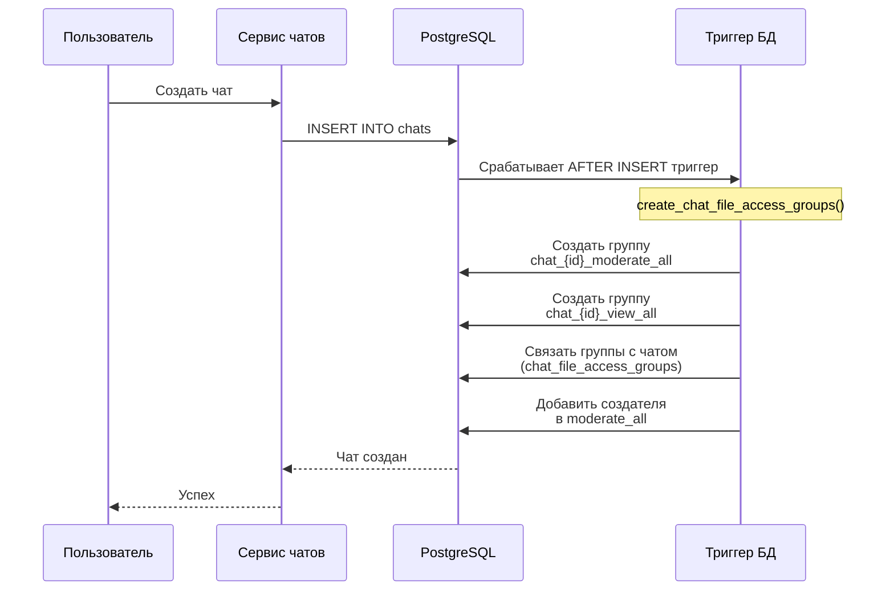

## Загрузка файла в чат

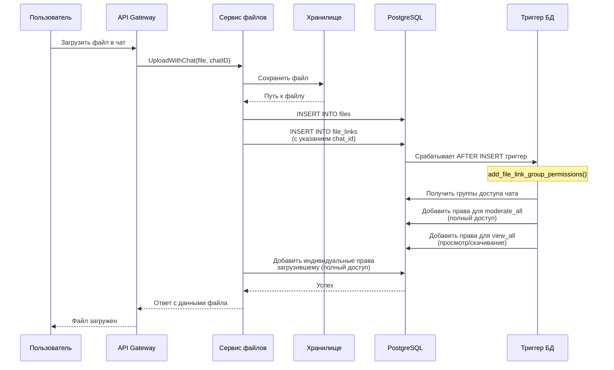

## Скачивание файла (проверка прав)

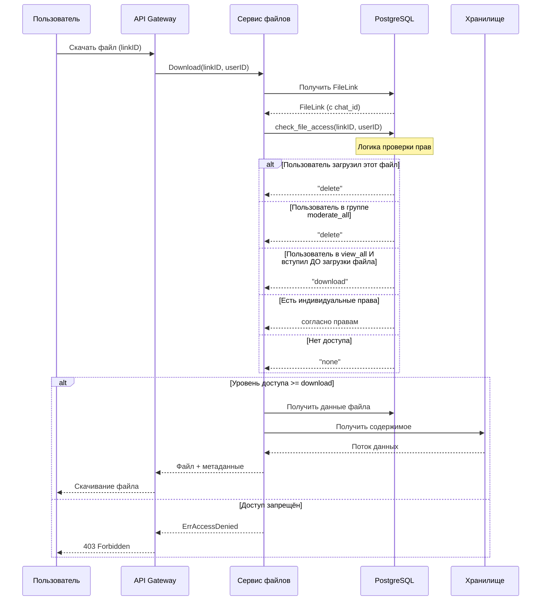

## Повышение до модератора

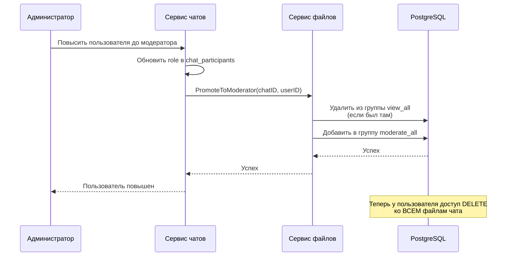

## Понижение модератора

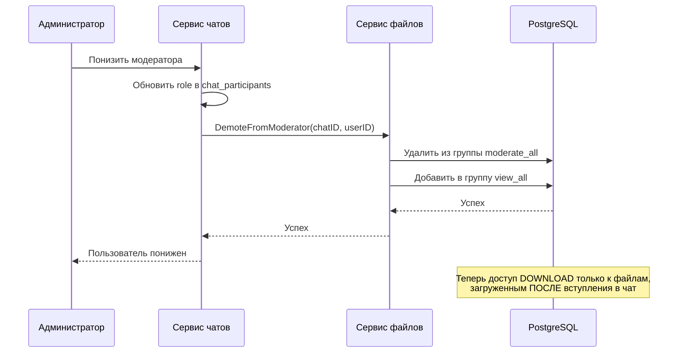

## Новый участник вступает в чат

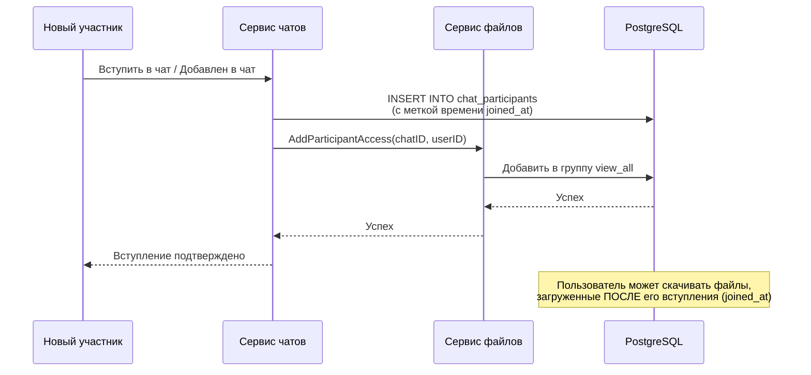

## Участник покидает чат

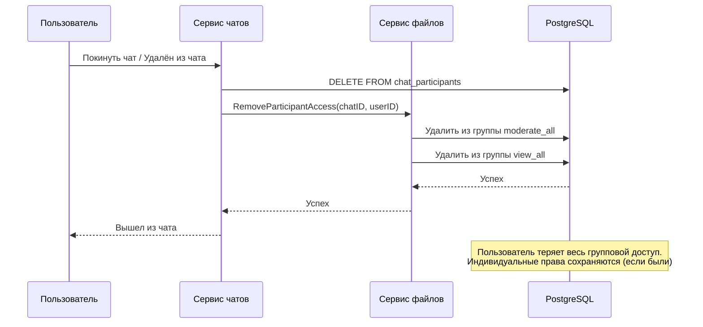

## Алгоритм проверки прав (check_file_access)

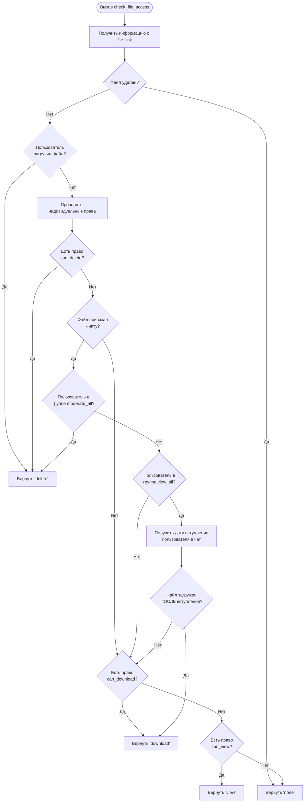

## Архитектура сервисов

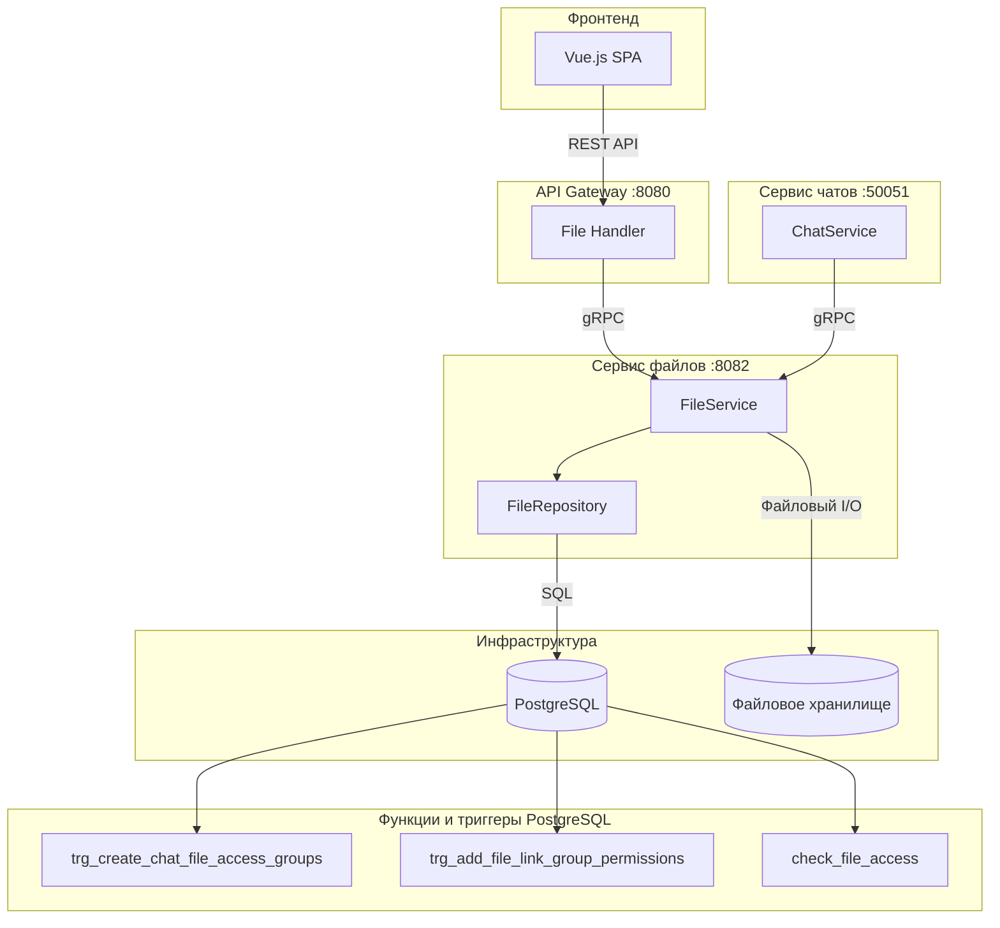

## Маппинг ролей: Чат → Файловые права

| Роль в чате | Группа файловых прав | Уровень доступа |
|-------------|---------------------|-----------------|
| owner | moderate_all | DELETE (все файлы) |
| admin | moderate_all | DELETE (все файлы) |
| moderator | moderate_all | DELETE (все файлы) |
| member | view_all | DOWNLOAD (файлы после joined_at) |
| guest | view_all | DOWNLOAD (файлы после joined_at) |

## Временной доступ для группы view_all

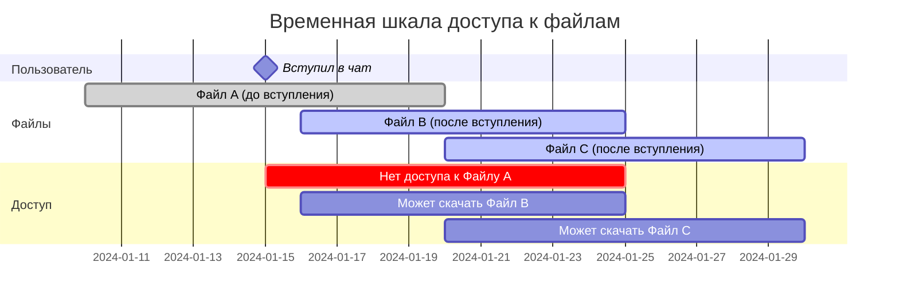

**Важно**: Модераторы (в группе moderate_all) имеют доступ ко ВСЕМ файлам, независимо от даты вступления.

---

## Связанные файлы

| Файл | Описание |
|------|----------|
| `migrations/files/002_chat_file_access_groups.sql` | Миграция БД с таблицами и триггерами |
| `services/files/internal/model/file.go` | Модели данных Go |
| `services/files/internal/repository/file.go` | Репозиторий с методами доступа к БД |
| `services/files/internal/service/file.go` | Бизнес-логика сервиса файлов |
| `services/files/internal/service/file_test.go` | Unit-тесты |
