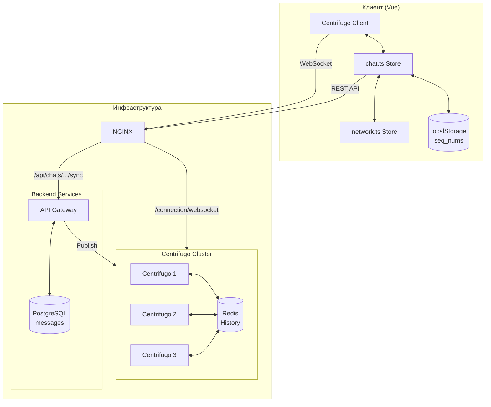
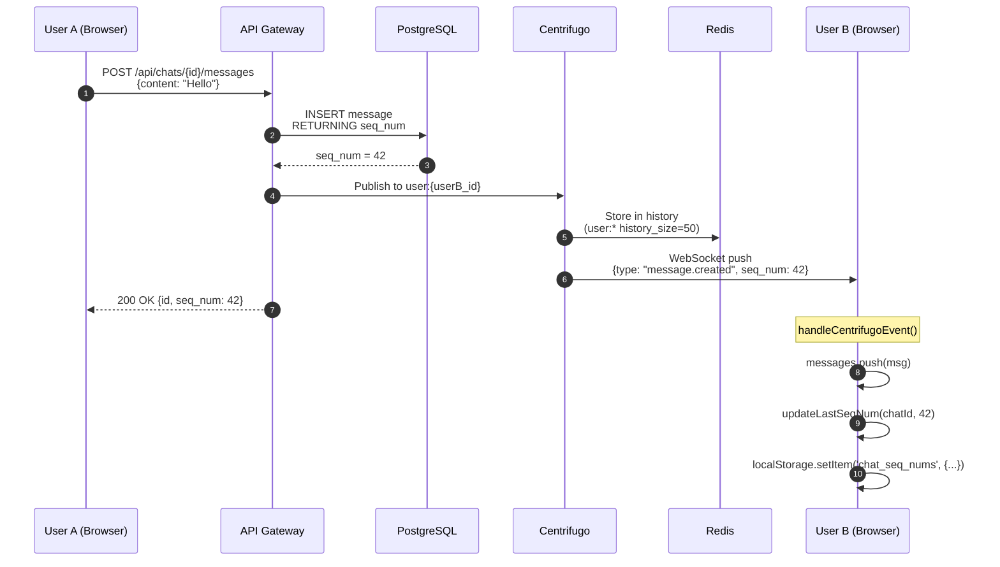
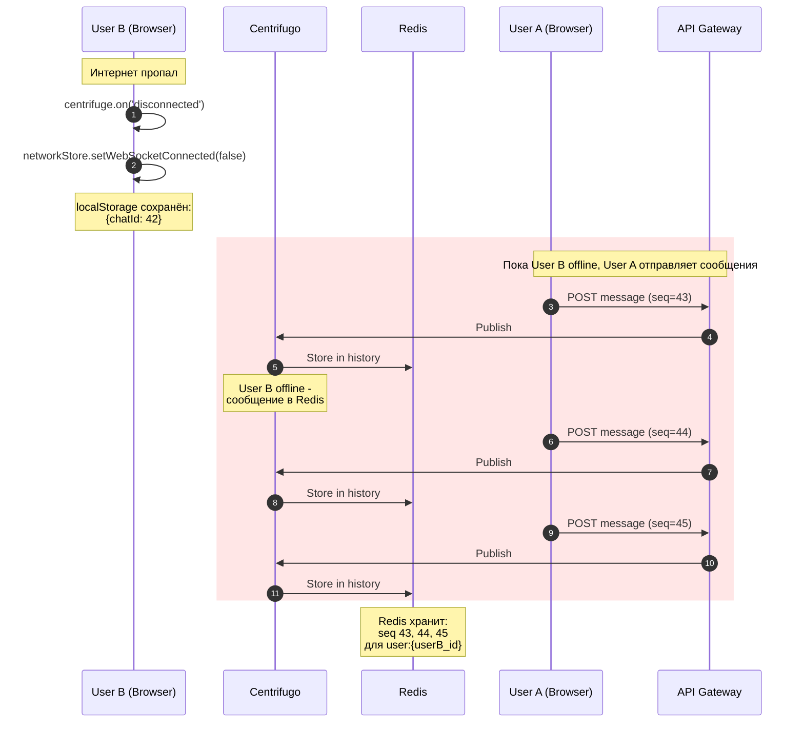
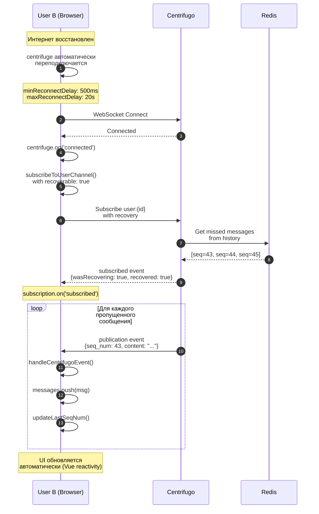
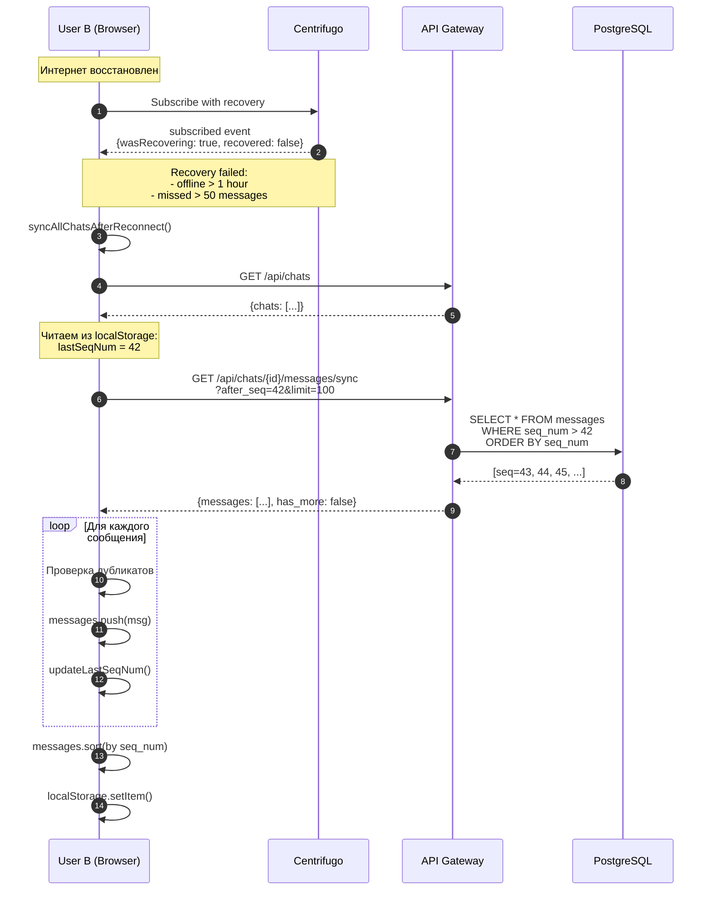
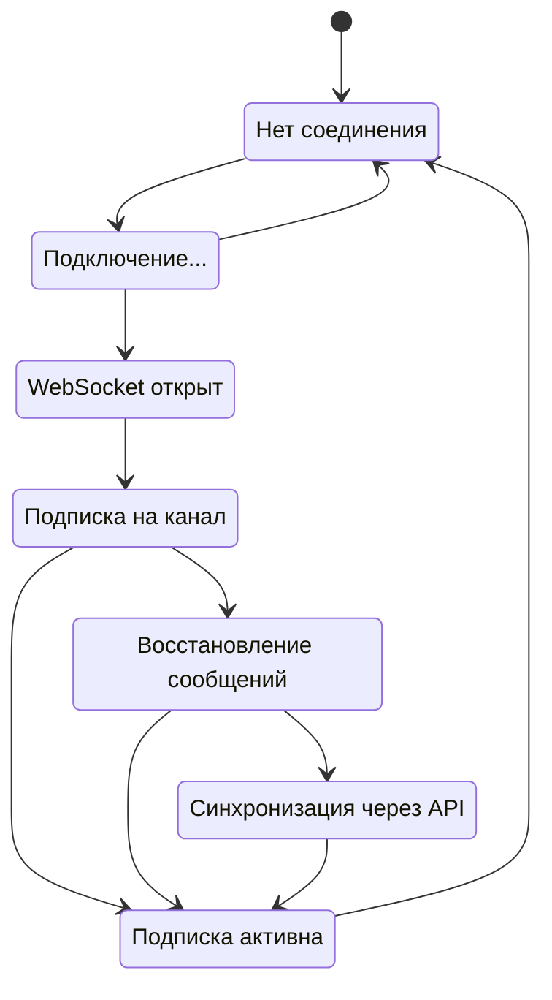
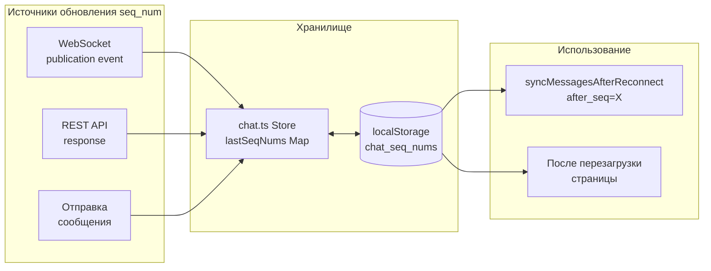
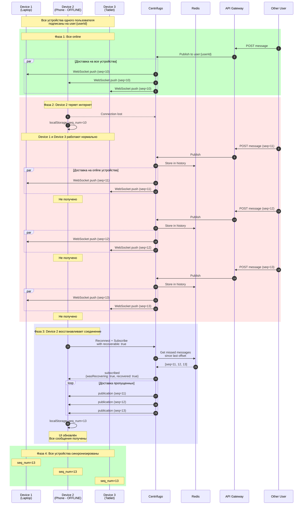

# WebSocket Recovery - Восстановление сообщений после потери связи

Документация описывает механизм автоматического восстановления пропущенных сообщений при временной потере интернет-соединения.

## Содержание

- [Архитектура](#архитектура)
- [Фаза 1: Нормальная работа](#фаза-1-нормальная-работа)
- [Фаза 2: Потеря соединения](#фаза-2-потеря-соединения)
- [Фаза 3: Centrifugo Recovery](#фаза-3-centrifugo-recovery)
- [Фаза 4: API Fallback](#фаза-4-api-fallback)
- [Состояния соединения](#состояния-соединения)
- [Хранение seq_num](#хранение-seq_num)
- [Конфигурация](#конфигурация)
- [Временная диаграмма](#временная-диаграмма)
- [Multi-Device сценарий](#multi-device-сценарий)
- [Тестирование](#тестирование)

---

## Архитектура



### Ключевые компоненты

| Компонент | Роль |
|-----------|------|
| **Centrifuge Client** | WebSocket клиент с автоматическим переподключением |
| **chat.ts Store** | Pinia store для управления сообщениями и синхронизацией |
| **network.ts Store** | Отслеживание состояния сети |
| **localStorage** | Персистентное хранение seq_num между сессиями |
| **Centrifugo** | WebSocket сервер с поддержкой history и recovery |
| **Redis** | Хранилище истории сообщений для recovery |
| **PostgreSQL** | Основное хранилище сообщений (источник истины) |

---

## Фаза 1: Нормальная работа

При нормальной работе сообщения доставляются через WebSocket в реальном времени.



### Что происходит

1. **User A** отправляет сообщение через REST API
2. **API Gateway** сохраняет в PostgreSQL и получает `seq_num`
3. **API Gateway** публикует событие в Centrifugo
4. **Centrifugo** сохраняет в Redis history и отправляет через WebSocket
5. **User B** получает сообщение, обновляет store и localStorage

---

## Фаза 2: Потеря соединения

При потере интернета клиент сохраняет последний известный `seq_num`, а Centrifugo продолжает накапливать сообщения в Redis.



### Что сохраняется

- **localStorage**: последний `seq_num` для каждого чата
- **Redis**: пропущенные сообщения (до 50 шт, до 1 часа для `user:*`)
- **PostgreSQL**: все сообщения (источник истины)

---

## Фаза 3: Centrifugo Recovery

При восстановлении соединения Centrifugo автоматически отправляет пропущенные сообщения из Redis history.



### Ключевые параметры

```typescript
// Подписка с включенным recovery
subscription = centrifuge.newSubscription(`user:${userId}`, {
  recoverable: true,  // Включает автоматическое восстановление
  getToken: async () => { ... }
})

// Обработка результата recovery
subscription.on('subscribed', (ctx) => {
  if (ctx.wasRecovering && ctx.recovered) {
    // Успех - сообщения придут через publication events
  } else if (ctx.wasRecovering && !ctx.recovered) {
    // Неудача - используем API fallback
    syncAllChatsAfterReconnect()
  }
})
```

---

## Фаза 4: API Fallback

Если Centrifugo Recovery не сработал (offline > 1 часа или пропущено > 50 сообщений), используется синхронизация через REST API.



### API Endpoint

```
GET /api/chats/{chatId}/messages/sync?after_seq=42&limit=100

Response:
{
  "messages": [
    { "id": "...", "seq_num": 43, "content": "...", ... },
    { "id": "...", "seq_num": 44, "content": "...", ... }
  ],
  "has_more": false
}
```

---

## Состояния соединения



**Переходы между состояниями:**

| Из | В | Триггер |
|----|---|---------|
| Start | Disconnected | Старт приложения |
| Disconnected | Connecting | `centrifuge.connect()` |
| Connecting | Connected | Успешное подключение |
| Connecting | Disconnected | Таймаут / Ошибка |
| Connected | Subscribing | Подписка на `user:*` канал |
| Subscribing | Subscribed | Подписка успешна |
| Subscribing | Recovering | `wasRecovering=true` |
| Recovering | Subscribed | `recovered=true` - сообщения доставлены |
| Recovering | APIFallback | `recovered=false` - нужен fallback |
| APIFallback | Subscribed | Синхронизация завершена |
| Subscribed | Disconnected | Потеря соединения |

---

## Хранение seq_num



### Формат хранения

```javascript
// localStorage key: "chat_seq_nums"
{
  "chat-uuid-1": 156,   // последний известный seq_num
  "chat-uuid-2": 89,
  "chat-uuid-3": 234
}
```

### Когда обновляется

| Событие | Действие |
|---------|----------|
| Получение сообщения через WebSocket | `updateLastSeqNum(chatId, msg.seq_num)` |
| Загрузка сообщений через REST | `updateLastSeqNum(chatId, maxSeqNum)` |
| Отправка собственного сообщения | `updateLastSeqNum(chatId, response.seq_num)` |

---

## Конфигурация

```mermaid
flowchart TB
    subgraph Centrifugo["Centrifugo Config"]
        direction TB
        UC["user:* namespace"]
        CC["chat:* namespace"]

        UC --- UCH["history_size: 50"]
        UC --- UCT["history_ttl: 1h"]
        UC --- UCR["force_recovery: true"]

        CC --- CCH["history_size: 100"]
        CC --- CCT["history_ttl: 24h"]
        CC --- CCR["force_recovery: true"]
    end

    subgraph VueClient["Vue Centrifuge Client"]
        direction TB
        RC["Reconnect Config"]
        SC["Subscription Config"]

        RC --- RCM["minReconnectDelay: 500ms"]
        RC --- RCX["maxReconnectDelay: 20s"]
        RC --- RCT["timeout: 10s"]

        SC --- SCR["recoverable: true"]
    end

    subgraph API["API Sync Endpoint"]
        direction TB
        EP["GET /messages/sync"]
        EP --- EPA["after_seq: number"]
        EP --- EPL["limit: number"]
        EP --- EPR["returns: messages[], has_more"]
    end
```



### Файлы конфигурации

| Файл | Параметры |
|------|-----------|
| `deployments/centrifugo/config.json` | history_size, history_ttl, force_recovery |
| `services/api-gateway/web/src/stores/chat.ts` | reconnect delays, recoverable |

### Centrifugo Config

```json
{
  "namespaces": [
    {
      "name": "user",
      "history_size": 50,
      "history_ttl": "1h",
      "force_recovery": true
    },
    {
      "name": "chat",
      "history_size": 100,
      "history_ttl": "24h",
      "force_recovery": true
    }
  ]
}
```

### Vue Client Config

```typescript
centrifuge = new Centrifuge(wsUrl, {
  token,
  minReconnectDelay: 500,      // 500ms
  maxReconnectDelay: 20000,    // 20 seconds
  timeout: 10000,              // 10 seconds
  maxServerPingDelay: 15000,   // 15 seconds
})

subscription = centrifuge.newSubscription(channel, {
  recoverable: true,
  getToken: async () => { ... }
})
```

---

## Временная диаграмма

```mermaid
gantt
    title Сценарий потери и восстановления связи
    dateFormat X
    axisFormat %s

    section Device A (online)
    Отправка msg1 (seq=1)    :a1, 0, 1
    Отправка msg2 (seq=2)    :a2, 3, 1
    Отправка msg3 (seq=3)    :a3, 5, 1
    Отправка msg4 (seq=4)    :a4, 7, 1
    Отправка msg5 (seq=5)    :a5, 9, 1

    section Device B
    Получение msg1           :b1, 0, 1
    OFFLINE                  :crit, offline, 2, 8
    Reconnect + Recovery     :b2, 10, 2
    Получение msg2-5         :b3, 12, 1

    section Centrifugo Redis
    Store msg2               :r2, 3, 7
    Store msg3               :r3, 5, 7
    Store msg4               :r4, 7, 5
    Store msg5               :r5, 9, 3

    section localStorage (Device B)
    seq_num = 1              :l1, 1, 11
    seq_num = 5              :l2, 13, 2
```



---

## Multi-Device сценарий

Когда у одного пользователя несколько устройств и одно из них теряет соединение.



### Ключевые особенности Multi-Device

| Аспект | Поведение |
|--------|-----------|
| **Канал подписки** | Все устройства подписаны на `user:{userId}` |
| **Независимость** | Каждое устройство имеет свой WebSocket и свой `seq_num` |
| **localStorage** | Каждое устройство хранит свой `seq_num` локально |
| **Recovery** | Centrifugo восстанавливает сообщения для каждого устройства отдельно |
| **Дубликаты** | Клиент фильтрует дубликаты по `message.id` |

### Почему это работает

1. **Centrifugo tracking** - Centrifugo отслеживает позицию каждого клиента отдельно
2. **Client offset** - При reconnect клиент сообщает свой последний offset
3. **Redis history** - Пропущенные сообщения хранятся в Redis до 1 часа (user:*) или 24 часов (chat:*)
4. **Automatic recovery** - `recoverable: true` включает автоматическую доставку пропущенных сообщений

---

## Тестирование

### E2E тесты

Расположение: `services/api-gateway/web/e2e-selenium/tests/websocket-recovery.spec.ts`

| Тест | Описание |
|------|----------|
| `Centrifugo Recovery` | Автоматическое восстановление через WebSocket |
| `API Fallback Sync` | Синхронизация через REST при отказе recovery |
| `Multi-Device Scenario` | Несколько устройств, одно offline |
| `seq_num Tracking` | Персистентность seq_num в localStorage |
| `Reconnect with Pending` | Отправка сообщений во время offline |

### Запуск тестов

```powershell
# Все тесты
.\services\api-gateway\web\run-recovery-test.ps1

# Конкретный тест
.\run-recovery-test.ps1 -Test automatic
.\run-recovery-test.ps1 -Test fallback
.\run-recovery-test.ps1 -Test multidevice

# Headless режим
.\run-recovery-test.ps1 -Headless
```

### Ручное тестирование

1. Откройте чат в двух браузерах (User A и User B)
2. Откройте DevTools → Network в браузере User B
3. Включите "Offline" режим
4. Отправьте несколько сообщений от User A
5. Отключите "Offline" режим у User B
6. Убедитесь, что сообщения появились автоматически (без refresh)

---

## Ограничения

| Ограничение | Значение | Fallback |
|-------------|----------|----------|
| Max offline time (user:*) | 1 час | API sync |
| Max missed messages (user:*) | 50 | API sync |
| Max offline time (chat:*) | 24 часа | API sync |
| Max missed messages (chat:*) | 100 | API sync |

---

## Связанные файлы

- `deployments/centrifugo/config.json` - конфигурация Centrifugo
- `services/api-gateway/web/src/stores/chat.ts` - Vue store с логикой recovery
- `services/api-gateway/web/src/stores/network.ts` - отслеживание состояния сети
- `services/api-gateway/internal/handler/chat.go` - API endpoint `/messages/sync`
- `services/api-gateway/web/e2e-selenium/tests/websocket-recovery.spec.ts` - E2E тесты
